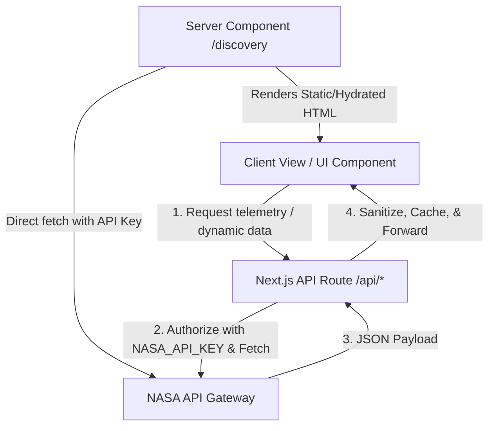

# AstroAid: System Architecture & Technical Specifications

This document outlines the architectural patterns, data-fetching pipelines, and styling frameworks implemented in the AstroAid application.

---

## 1. System Topology & Directory Structure

AstroAid is built on the Next.js App Router framework, leveraging React Server Components (RSC) for optimized data fetching, initial paint speed, and improved SEO.

```
├── app/
│   ├── layout.js          # Root layout defining document shell & global providers
│   ├── page.js            # Home landing view & gateway entry points
│   ├── discovery/         # Phenomenon Archive routes
│   │   ├── page.js        # Categorized lists & search layout
│   │   └── [id]/          # Dynamic deep-dive phenomenon pages
│   ├── tracker/           # Live Mission Control (ISS tracking viewport)
│   │   └── page.js
│   ├── api/               # Server-side route handlers (NASA proxy endpoints)
│   │   └── weather/       # Proxy to NASA DONKI API
│   │       └── route.js
│   └── globals.css        # Global CSS, Tailwind layers, and design variables
├── components/            # Shared, reusable UI components (Client & Server)
│   ├── ui/                # Low-level primitives (Buttons, Cards, Badges)
│   ├── Header.js          # Responsive navigation header
│   └── SpaceWeather.js    # Space Weather Intelligence dashboard component
├── hooks/                 # Custom React hooks (useISSPosition, useSpaceWeather)
└── public/                # Static assets (images, vectors, system graphics)
```

---

## 2. Data-Fetching Architecture & Pipeline

To optimize page loading, secure API secrets, and circumvent rate-limiting issues associated with NASA's Open APIs, AstroAid uses a hybrid server/client data pipeline.



### Static & Semi-Static Data (Server-Side)
-   **Phenomenon Archive**: Scientific information and descriptions are fetched or statically rendered from structured static JSON stores during the build phase. This ensures near-instantaneous page routing and excellent Core Web Vitals.
-   **Dynamic Entity Details**: Utilizes React Server Components (RSC) to perform server-side API integration, rendering the static content before sending HTML to the client browser.

### Real-Time & Streamed Data (Client-Side)
-   **Live Mission Control (ISS Telemetry)**: The client polls the ISS Open Notify API at a configured 5-second interval using custom hooks (`useISSPosition`). The payload is held in client state, updating the SVG/Leaflet mapping engine without full-page re-renders.
-   **Space Weather Intelligence Center**: Connects to the local server proxy `/api/weather` to fetch Solar Flare (FLR) and Geomagnetic Storm (GST) logs from NASA's Space Weather Database of Notifications, Knowledge, and Information (DONKI). This architecture keeps the developer API key secure on the server side.

---

## 3. CSS/Tailwind Layering & Double Background Resolution

### The "Double Background" Problem
When designing rich dark-mode interfaces, a common bug occurs where multiple parent elements (`<html>`, `<body>`, and container `<main>` or `<div>` elements) have separate dark background utilities (such as `bg-zinc-950` or `bg-slate-900`) applied to them. 

This causes:
1.  **Redundant GPU Repaints**: The browser renders overlapping dark layers, causing rendering performance to drop during animations and scrolling.
2.  **Sub-pixel Rendering Flicker**: Scroll events or page transitions can create microscopic layout shifts, displaying a lighter or darker background sliver underneath.
3.  **UI Inconsistency**: Component backdrops feel muddy as layers stack opacity values.

### The Solution: Layered Canvas Architecture
AstroAid implements a strict single-responsibility background container at the layout level and uses transparent layer styling for internal pages.

```
+-------------------------------------------------------------+
| Root HTML/Body (bg-neutral-950 Only)                       |
|  +-------------------------------------------------------+  |
|  | Header Navigation (bg-transparent backdrop-blur-md)   |  |
|  +-------------------------------------------------------+  |
|  +-------------------------------------------------------+  |
|  | Page Main Content (bg-transparent, no background css) |  |
|  |   +-------------------------------------------------+ |  |
|  |   | Glass Card (bg-neutral-900/40 border-neutral-800) |  |
|  |   +-------------------------------------------------+ |  |
|  +-------------------------------------------------------+  |
+-------------------------------------------------------------+
```

1.  **Root Canvas Binding**: The base canvas color is set *only once* in the `app/layout.js` inside the `<body>` element.
2.  **Page Level Neutrality**: Pages inside the App Router (`page.js` templates) do not use styling background classes (e.g. `bg-*`). They default to transparent backdrops (`bg-transparent`), letting the root canvas show through.
3.  **Elevated Surface Elements**: Content cards, dashboards, and modal overlays use subtle translucent layers defined in `app/globals.css` to build elevation:
    ```css
    @layer components {
      .glass-panel {
        @apply bg-neutral-900/40 backdrop-blur-md border border-neutral-800/80 shadow-2xl;
      }
    }
    ```
4.  **Hardware-Accelerated Canvas**: By restricting fill rendering to a single surface element, mobile browsers optimize scrolling and rendering paths, ensuring a smooth 60fps experience.
