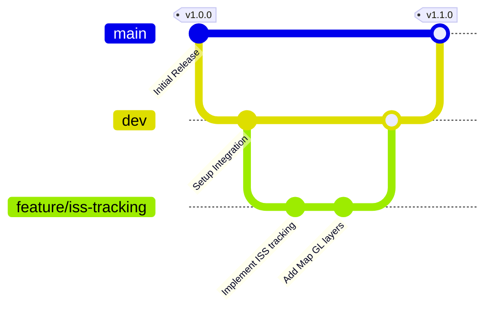

# Contributing to AstroAid

Thank you for your interest in contributing to AstroAid. This repository is built on rigorous engineering standards to ensure high-fidelity data visualization, API reliability, and responsive design. Please review the following guidelines before initiating any pull requests or modifications.

---

## 1. Branching Strategy & Lifecycle

We employ a structured Git-Flow branching model to manage our delivery pipeline. All contributions must adhere to this lifecycle:



### Core Branches
*   **`main`**: Represents the current production-ready state of the application. Code here must be highly stable and pass all automated testing suites. Direct pushes to `main` are strictly prohibited.
*   **`dev`**: The primary integration branch. All new feature branches must branch off `dev` and merge back into `dev` after successful code review and CI verification.

### Supporting Branches
*   **Feature Branches (`feature/*`)**: Used to build new capabilities (e.g., `feature/iss-realtime-map`). These branches must be created from the latest `dev` branch.
*   **Bugfix Branches (`bugfix/*`)**: Used for routine bug fixes resolved against the `dev` branch.
*   **Hotfix Branches (`hotfix/*`)**: Created directly from `main` to address critical production issues. Once verified, they are merged back into both `main` and `dev`.

---

## 2. Local Development Workflow

Follow these steps to contribute code to the repository:

### Step 1: Fork and Clone
Fork the repository on GitHub, then clone it to your local environment:
```bash
git clone https://github.com/your-username/AstroAid.git
cd AstroAid
```

### Step 2: Sync with Upstream and Create a Branch
Ensure your local `dev` branch is up-to-date, then spawn a feature branch:
```bash
git checkout dev
git pull upstream dev
git checkout -b feature/your-feature-name
```

### Step 3: Implement and Style
*   Write clean, modular Next.js components utilizing React Hooks.
*   Apply styling using Tailwind CSS, ensuring utility classes do not conflict with the layout base colors (avoiding double-background artifacts).
*   Ensure all new features include descriptive typing and handle loading/error states gracefully.

### Step 4: Run Verification Suites
Prior to committing, run the following verification checks:
*   Linting check: `npm run lint`
*   Build verification: `npm run build`
*   Local formatting: `npm run format`

### Step 5: Commit Your Changes
We utilize conventional commit specifications. Ensure your commit messages are clear and follow this structure:
`type(scope): description`

**Examples:**
*   `feat(control): implement real-time ISS telemetry dashboard`
*   `fix(weather): resolve layout shift in space-weather grid`
*   `docs(architecture): clarify API caching strategy`

---

## 3. Pull Request (PR) Protocols

All contributions are subject to a code review process.

1.  **Create the PR**: Submit a pull request from your feature branch to AstroAid's `dev` branch.
2.  **Complete the Template**: Describe the changes, outline the testing conducted, list any affected components, and attach screenshots or layout recordings if modifying the UI.
3.  **CI/CD Pipeline**: Your branch must pass all automated builds, lint checks, and test runner suites before review can commence.
4.  **Peer Review**: At least one maintainer review is required. Address any feedback promptly.
5.  **Squash and Merge**: Once approved, your pull request will be squashed and merged into `dev` by a maintainer to keep the commit history clean.
